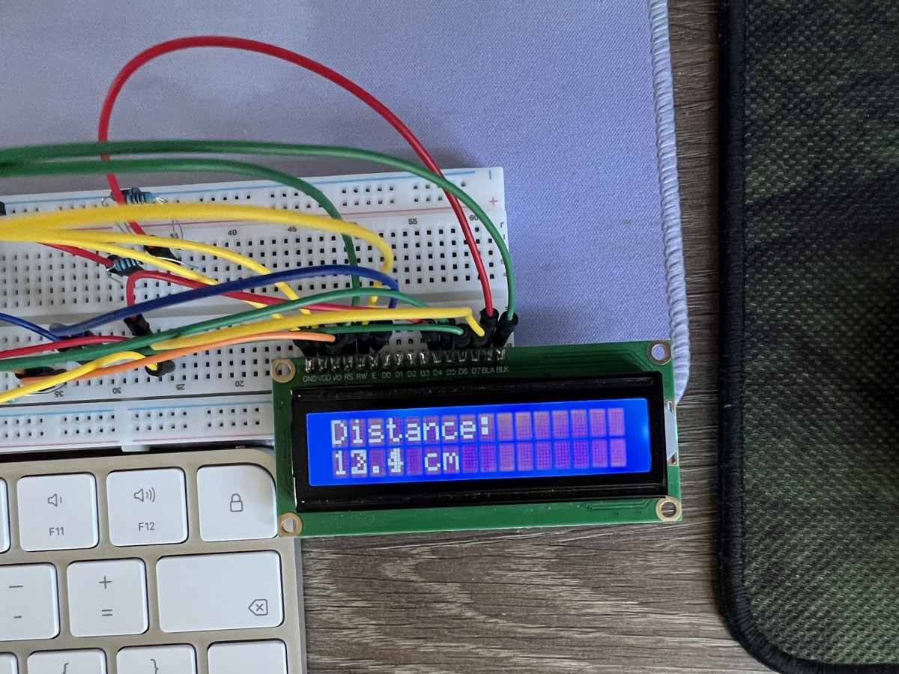

# measure_distance 📏

An ultrasonic distance meter built on a **Raspberry Pi Pico W**: an HC-SR04
sensor measures the distance to the nearest object three times a second and
shows it live on an LCD1602 character display. Runs standalone on any USB
power source — no computer needed.



## How it works

The HC-SR04 works like a bat: the Pico pulses its **TRIG** pin, the sensor
fires a burst of 40 kHz ultrasound, and its **ECHO** pin stays high for
exactly as long as the sound is in flight. The code times that pulse and
computes:

```
distance = flight_time × 340 m/s ÷ 2      # there and back, hence ÷ 2
```

The result is written to the LCD (driven directly over GPIO in 4-bit parallel
mode) and also printed to USB serial. Anything past ~400 cm — or a missed
echo — shows as `out of range` instead of a bogus number, and every wait on
the sensor has a timeout so a missed pulse can never freeze the program.

## Hardware

| Part | Notes |
|---|---|
| Raspberry Pi Pico W | running MicroPython |
| HC-SR04 ultrasonic sensor | |
| LCD1602 display | plain parallel type, no I2C backpack |
| 220 Ω resistor | backlight current limiter |
| ~7.7 kΩ of resistance (4.7k + 2k + 1k in series) | contrast voltage divider |
| breadboard + jumper wires | |

## Wiring

Physical pin numbers count from the USB connector.

### HC-SR04

| Sensor pin | Pico |
|---|---|
| VCC | VBUS (pin 40, 5 V) |
| TRIG | GP17 (pin 22) |
| ECHO | GP16 (pin 21) |
| GND | GND |

### LCD1602

| LCD pin | Connection |
|---|---|
| VSS | GND (pin 3) |
| VDD | VBUS (pin 40, 5 V) |
| V0 | 4.7k + 2k + 1k in series → GND (pin 8) — sets the contrast |
| RS | GP2 (pin 4) |
| RW | GND (pin 13) — write-only mode |
| E | GP3 (pin 5) |
| D4–D7 | GP4–GP7 (pins 6, 7, 9, 10) — 4-bit mode, D0–D3 unconnected |
| A | 220 Ω → VSYS (pin 39) — backlight |
| K | GND (pin 18) |

**Why the two resistors?** They do opposite jobs. The 220 Ω is a *valve*: it
caps the backlight LED's current at a safe ~20 mA. The 7.7 kΩ chain is a
*voltage picker*: together with a resistance built into the LCD it forms a
voltage divider that puts ~0.5 V on the contrast pin — the sweet spot where
text is crisp without ghost blocks in the empty cells. (A contrast
potentiometer is the same divider with a knob.)

## Install

Flash [MicroPython](https://micropython.org/download/RPI_PICO_W/) onto the
Pico, then copy both files with [mpremote](https://docs.micropython.org/en/latest/reference/mpremote.html):

```sh
mpremote fs cp lcd1602.py :lcd1602.py
mpremote fs cp distance_lcd.py :main.py     # main.py runs automatically at boot
mpremote reset
```

Watch the readings from a computer (optional):

```sh
mpremote repl        # exit with Ctrl-]
```

## Files

- `distance_lcd.py` — the program (deployed as `main.py`); heavily commented
- `lcd1602.py` — minimal HD44780 driver for 4-bit GPIO mode; also commented

## Lessons learned the hard way

Debugging this build was an education in classic hardware gremlins:

- **A row of solid blocks** on an LCD1602 means it has power but never
  received its init sequence — check the signal wires. Ours turned out to be
  the E (enable) wire sitting on a 5 V pin: a doorbell that's held down never
  rings.
- **Floating pins aren't "off".** An unconnected RW or V0 picks up noise and
  behaves randomly. Everything gets a wire, even if that wire just goes to
  ground.
- **Breadboard power rails often have a break in the middle** — a "grounded"
  wire on the wrong half is connected to nothing. When in doubt, wire
  directly to the Pico's own GND pins.
- **Charge-only USB cables are real** and they are everywhere. The board
  powers up, the program runs, and the computer sees absolutely nothing.
  Two cables were sacrificed to this discovery.
